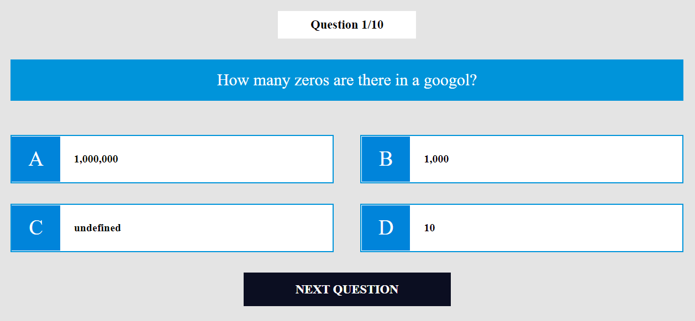

# Quiz is a simple frontend ReactJS application where you can answer some questions from opentdb.com

### Features:
- The application calculates right and wrong answers
- It shows you the results
- This application acquires questions and answers from the open API of opentdb.com.
- The application was created for educational purposes to study ReactJS

### Technologies:
- The main language of the application is JavaScript. 
- It uses the ReactJS library.
- The project was bootstrapped with Create-react-app

#### Demo is here: [Click me!](http://quiz.surkoff.su)
